## Statistical inference
```{r echo = FALSE, fig.align="center", out.width="100%", fig.cap = "Text taken from Wikipedia."}
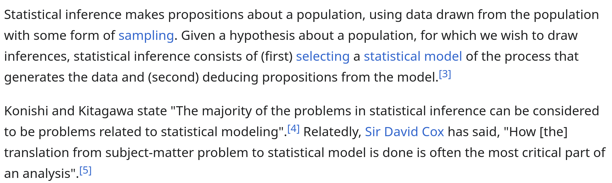
```


---

## 

```{r echo = FALSE, fig.align="center", out.width="90%", fig.cap = "A caricature of statistical inference. Image generated by ChatGPT."}
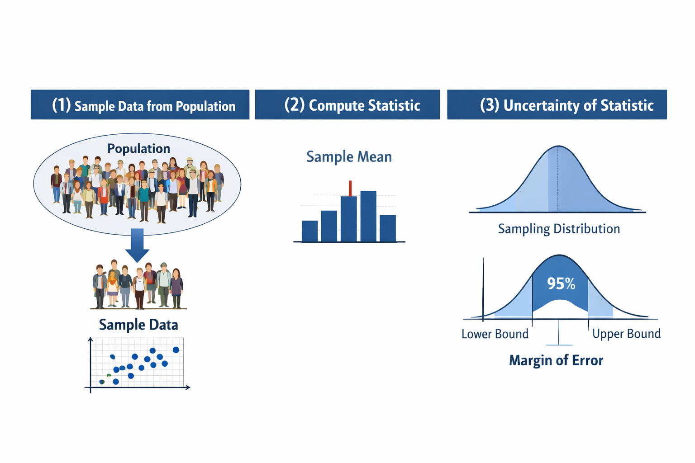
```
---
  
## Example: MPG or GPM ?

```{r echo = FALSE, fig.align = "center", fig.cap = 'From David Hand\'s "Deconstructing statistical questions".', out.width="80%"}
knitr::include_graphics("figures/cars_hand.png")
```


---

## Example: Simpson's paradox
```{r simpson_paradox, echo = FALSE, fig.retina = 3, out.width="80%", fig.cap = "Table taken from Wikipedia.", fig.align="center"}
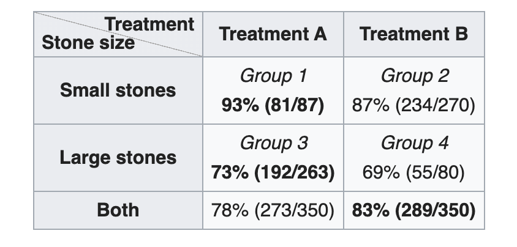
```

--
In this example, treatment $A$ is better for both small and large kidney stones. However, since treatment $A$ is applied more frequently to the large kidney stones 
(which has a smaller success rate), overall treatment $A$ success rate is "worse" than treatment $B$.
---

```{r ucb_admission, echo = FALSE, out.width="50%", fig.show = "hold", fig.align="center", fig.cap = "Admission rate for students applying to UC Berkeley."}
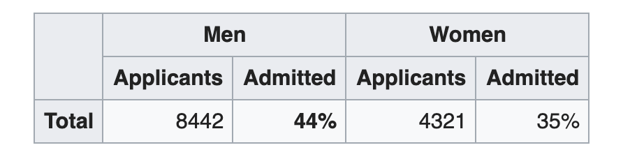
```

--
```{r ucb_admission2, echo = FALSE, out.width="50%", fig.show = "hold", fig.align="center", fig.cap = "Admission rate for students applying to UC Berkeley (split into disciplines)"}
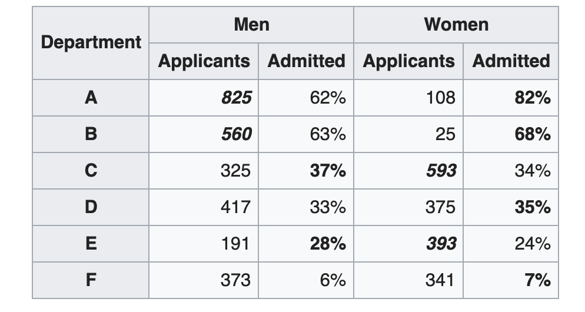
```

---
## Example: Regression to the mean
```{r galton, echo = FALSE, warning = FALSE, message = FALSE, out.width="60%",fig.cap = "Height of Sons and Fathers (Galton 1866)"}
Galton <- read.table("https://ytliu0.github.io/Stat390EF-R-Independent-Study-archive/RMarkdownExercises/Galton.txt", header = TRUE)
library(ggplot2)
Galton <- dplyr::rename(Galton, Child = Height)
Galton_gather <- tidyr::gather(Galton, key = "Relationship", value = "Height", Father, Mother, Child)
Galton_gather <- dplyr::filter(Galton_gather, Relationship != "Mother", Gender == "M")
ggplot(Galton_gather, aes(x = Height)) + geom_histogram(bins = 20) + facet_wrap(~Relationship)
```

---

```{r galton2, echo = FALSE, out.width="80%",fig.cap = "Fathers' and sons' heights were standardized. Regression line (colored blue) has slope approximately 0.39", message=FALSE}
Galton_sons <- dplyr::filter(Galton, Gender == "M")
Galton_sons$Father <- scale(Galton_sons$Father)
Galton_sons$Child <- scale(Galton_sons$Child)
library(ggplot2)
ggplot(Galton_sons, aes(x = Father, y = Child)) + geom_point() + stat_smooth(method = "lm", se = FALSE) + geom_abline(intercept = 0, slope = 1, linetype = "dashed")
```

Roughly speaking, if one model
\begin{gather*}
\texttt{son}_i = \beta_0 + \beta_1 \times \texttt{father}_i + \epsilon_i
\end{gather*}
then the fathers' heights explains around $40\%$ of the **variability** in sons' heights, with the remaining variability due to noise. 

---
## Example: Extreme events
```{r extreme, echo = FALSE, fig.retina = 3, out.width="70%", fig.cap = "Annual sea level maximum from 1912 to 1992 as recorded in Dover, England", message=FALSE, warning=FALSE}
library(evd)
sealevel <- tibble::as_tibble(sealevel)
sealevel <- dplyr::mutate(sealevel, year = 1912:1992)
library(ggplot2)
ggplot(sealevel,aes(x = year,y = dover)) + geom_line() + stat_smooth(se = FALSE) + ylab("sea level")
```

---
Q. How likely is a sea level of $5$ meters in Dover, England ?

--

A. Not very likely (predicted less often than once in a hundred years).

```{r dover2, error = TRUE, echo = FALSE, fig.retina = 3, out.width = "70%", fig.align="center"}
sl.no <- na.omit(sealevel[,1])
evd_mod1 <- fgev(sl.no$dover)
plot(evd_mod1,which = 4,a=0.2)
```

---
## Example: Challenger shuttle
In January of 1986 the space shuttle Challenger exploded shortly
after launch. 

Investigation of the incident suggest that
the cause of the crash maybe related to the rubber O-ring seals used
in the rocket booster. 

O-rings are more brittle at lower
temperatures and the temperature at the time of the launch was roughly $0$ degrees Celcius.

--

Q. Can one predict the failure of the O-rings in advance ? 

--

There is data regarding the failure rate of O-rings for 23 previous shuttle
missions. There is 6 O-rings used for each shuttle mission, and the
number of O-rings damaged for each mission was recorded.

---

```{r challenger, echo = FALSE, fig.retina = 3, out.width = "70%", fig.asp = 0.8,fig.align="center", message = FALSE, warning=FALSE}
library("faraway")
library(ggplot2)
  data(orings)
  df <- orings 
  df$temp <- (df$temp - 32)*5/9
  temp <- (seq(25, 85,1) - 32)*5/9
  logitmod <- glm(cbind(damage, 6 - damage) ~ temp, 
                  family = binomial, df)
  yhat <- ilogit(coef(logitmod)[1] + coef(logitmod)[2]*temp)
  df2 <- data.frame(x = temp, y = yhat)
  ggplot(df, aes (x = temp, y = damage/6)) + geom_point() + xlab("Temperature in Celcius") + ylab("Proportion of O-rings damaged") + 
    geom_line(data = df2, aes ( x = temp, y = yhat), color = "red")
```

Based on the data, a statistician estimates that the probability an O-ring will be damaged is $p = 0.99$ (when the ambient air temperature is $0$ degree Celcius)
and the probability that all six O-rings will be damaged is at least $0.94$. 

---

## Sampling strategies

Given a population of objects/individuals/entities

+ The Bad
   - Convenience sampling or voluntary sampling.
   - Don't know the probability of an element being in the sample.
   - Hence can't know the true population that the sample represents. 
   
--

```{r echo = FALSE, fig.align = "center", fig.cap = "", out.width="60%"}

```

---

Given a population of objects/individuals/entities

+ The Good (variants of random sampling)
  - Simple sampling: Elements chosen randomly with equal probabilities. 
  - Stratified sampling: Split population into subgroup and do simple random sampling for every sub-group.
  - Systematic sampling: Randomly ordered the elements then select elements in the $n, 2n, 3n, \dots$ positions. 
  - Cluster sampling: Split population into subgroups, choose subgroups at random and keep all elements in each chosen subgroup. 
  

```{r echo = FALSE, fig.align = "center", fig.cap = "Random sampling variants (figure from blog post on upGrad.com)"}
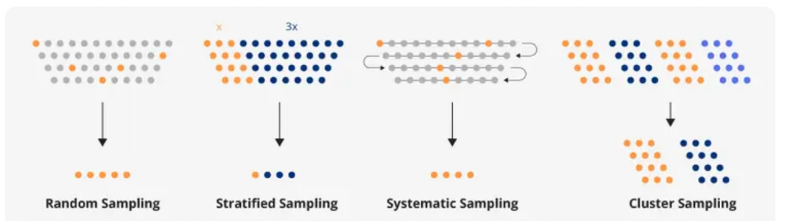
```

---
## Lanarkshire milk experiment

+ A dietary experiment in Lanarkshire, Scotland during 1930s.

+ Roughly $18500$ children was recruited from $67$ schools.

+ Type of milk given varied between (but not within) schools. 

+ Children was measured (weight/height) before and after the experiment.

```{r echo = FALSE, fig.align = "center", fig.cap = 'From S. Senn "Student and the Lanarkshire milk expriment" (2022)', out.width="60%"}
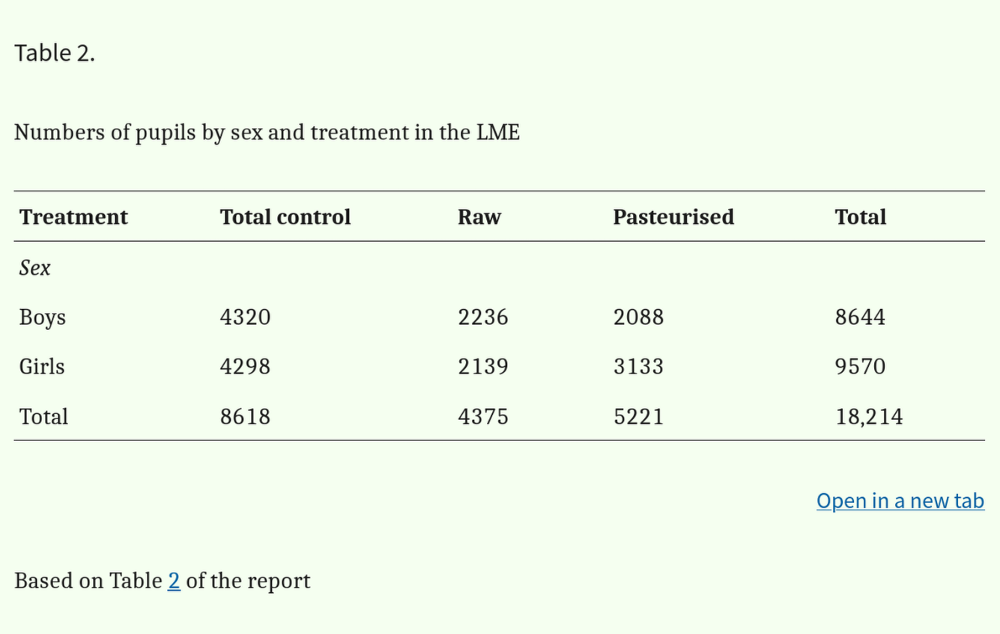
```

---
```{r echo = FALSE, echo = FALSE, fig.align = "center", fig.cap = 'From Student "The Lanarkshire milk expriment" (1931)', out.width="90%"}
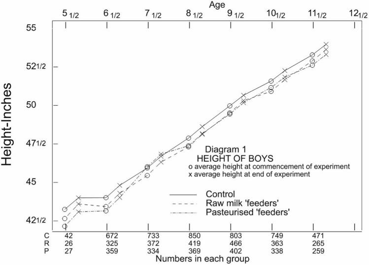
```

---
```{r echo = FALSE, echo = FALSE, fig.align = "center", fig.cap = 'From Student "The Lanarkshire milk expriment" (1931)', out.width="90%"}
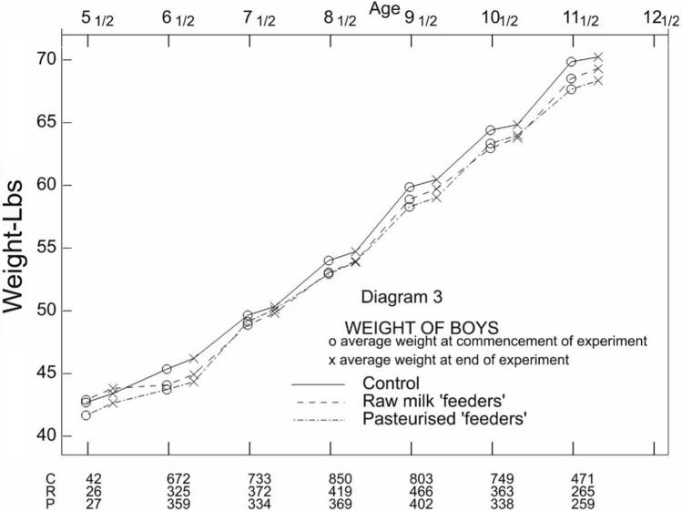
```

---

## Lanarkshire experiment conclusions

+ Feeders have no advantage vs control in growth of weight/height.

+ Lack of evidence potentially due to selection bias.

+ Assignments of children to feeder and control was supposed to be done alphabetically or randomly, but some teachers intentionally assign smaller, weaker, or poorer students to feeders.

+ Above issue also lead to confounding effects as initial weighting was done in winter clothing and final weighting was done in summer clothing.

+ Finally, cannot compare between raw and pasteurized milk as, in any given school, non-control students either gets only raw milk or only pasteurized milk. Allocation of type of milk to  schools was not randomized.

---
## Bootstrapping
```{r echo = FALSE, fig.align="center", out.width="60%", fig.cap = ""}

```

Q. How do we obtain uncertainty estimates for a chosen/given statistic $T$ ?

+ Estimates that hold in finite sample may be intractable (unless one make restrictive modeling assumptions).

+ Estimates that hold asymptotically may be inappropriate for a given sample size. 

---

If we assume that our sample is **representative** of the population then we can replace the population with the sampled data, and
resample from the sampled data!!!

```{r echo = FALSE, fig.align="center", out.width="70%", fig.cap = ""}
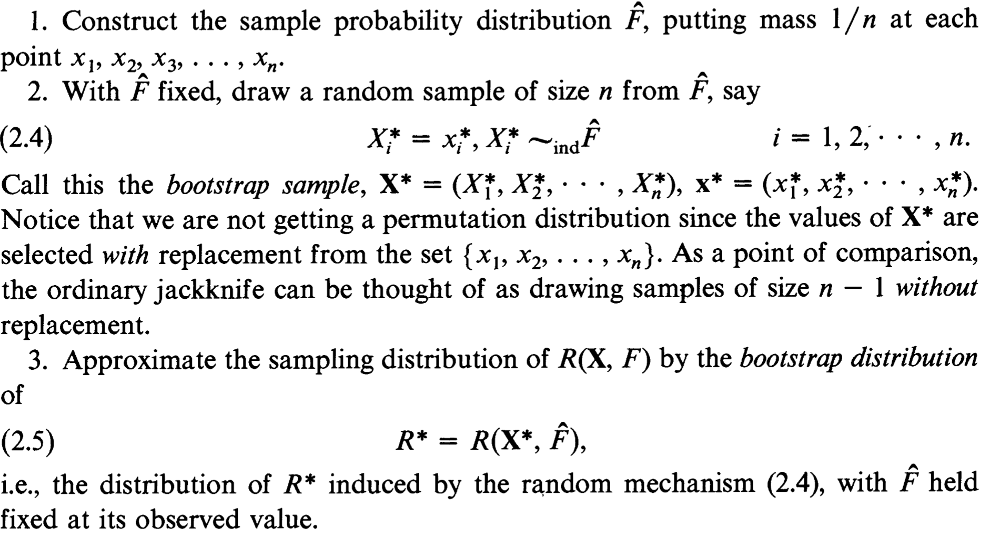
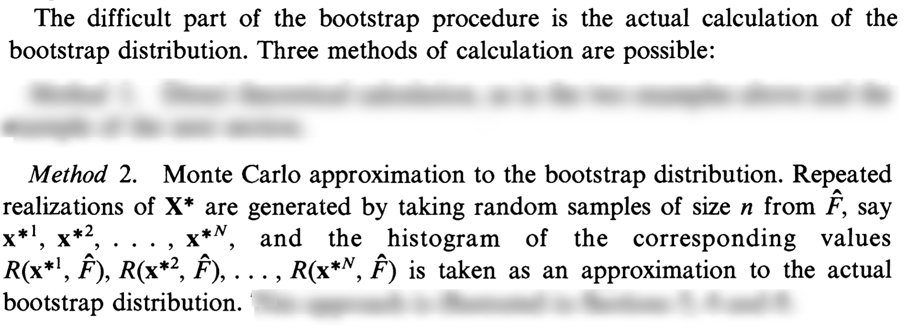
```
From [B. Efron's 1977 Rietz lecture](DOI: 10.1214/aos/1176344552).

---
## Bootstrapping example

```{r echo = -c(1:2)}
library(boot)
data(darwin)
darwin$y
```

The *darwin* data frame contains $15$ observations from an experiment by Charles Darwin to examine the superiority of cross-fertilized plants over self-fertilized plants. 

+ Each observation consisted of one cross-fertilized plant and one self-fertilized plant that germinated at the same time and grew in same pot.

+ The plants were measured at a fixed time after planting and the difference in heights between the cross- and self-fertilized plants are recorded. 

+ We are interested in determining if there is any difference between cross-fertilized plants over self-fertilized plants. 

+ A reasonable statistic is then $T = \bar{Y}$. For this dataset, $T = `r round(mean(darwin$y),3)`$.

+ Uncertainy estimate for $T$ under the assumption of **no difference**,
can be obtained by "swapping" the labels of plants from a single observation. 

---

```{r fig.align = "center", out.width="80%" }
nmc <- 1000
T <- mean(darwin$y)
n <- length(darwin$y)
Tvec <- numeric(nmc)
for(i in 1:nmc){
  labels_i <- sample(c(-1,1), size = n, replace = TRUE)
  Tvec[i] <- mean(labels_i*darwin$y)
}
hist(Tvec)
abline(v = T, lwd = 3, col = "red")
```

